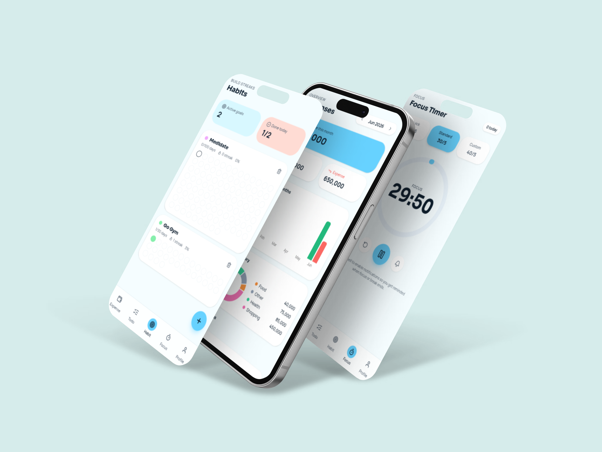

# checkcheck

> Money, Habit, Tasks, Focus -- Your offline-first personal productivity dashboard.



## Overview

**checkcheck** (chkchk) is a fast, mobile-first productivity app that runs entirely in your browser. No signup, no server, no cloud dependency. All data is stored locally in your browser using IndexedDB, so it works offline and your data stays on your device.

### Features

| Section | Description |
|---------|-------------|
| **Expense** | Track income and expenses with categories, bar charts, pie charts, and monthly views |
| **Todo** | Manage daily tasks with toggle-done functionality and today/done tabs |
| **Habit** | Build daily habit streaks with visual progress grids, configurable duration (7/21/30/66/100 days) |
| **Focus** | Pomodoro-style focus timer with presets, audio chime, browser notifications, and session tracking |
| **Profile** | Data management: export backup (JSON), restore from backup, clear all data, and view statistics |

## Tech Stack

- **React 19** + **TanStack Start** -- Full-stack React framework with file-based routing
- **Tailwind CSS v4** + **shadcn/ui** -- Utility-first styling with accessible component library
- **Dexie.js** -- IndexedDB wrapper for offline data persistence
- **Recharts** -- Bar charts and pie charts for financial data visualization
- **Vite 7** + **TypeScript 5.8** -- Fast build tooling with strict type checking
- **Lucide React** -- Icon library
- **Sonner** -- Toast notifications
- **date-fns** -- Date manipulation

## Getting Started

### Prerequisites

- Node.js (or Bun) with pnpm as the package manager

### Installation

```bash
pnpm install
```

Or if using Bun:

```bash
bun install
```

### Development

```bash
pnpm dev
```

The app will be available at `http://localhost:8080` (or the next available port).

### Build for Production

```bash
pnpm build          # Production build
pnpm build:dev      # Development build
```

### Preview Production Build

```bash
pnpm preview
```

### Linting & Formatting

```bash
pnpm lint           # Run ESLint
pnpm format         # Run Prettier (auto-fix)
```

## Project Structure

```
chkchk/
├── src/
│   ├── components/
│   │   ├── ui/          # shadcn/ui reusable components
│   │   └── AppShell.tsx # Main app shell with bottom tab navigation
│   ├── lib/
│   │   ├── db.ts        # Dexie IndexedDB schema & database instance
│   │   └── utils.ts     # Utility functions
│   ├── routes/
│   │   ├── __root.tsx   # Root layout with providers, meta tags, PWA manifest
│   │   ├── index.tsx    # Redirects to /habit
│   │   ├── expense.tsx  # Expense tracking page
│   │   ├── todo.tsx     # Todo list page
│   │   ├── habit.tsx    # Habit streak tracker page
│   │   ├── focus.tsx   # Focus timer page
│   │   └── profile.tsx  # Data management & stats page
│   ├── styles.css       # Tailwind CSS theme with semantic color tokens
│   ├── router.tsx       # Router factory with QueryClient
│   ├── server.ts        # SSR server entry
│   └── start.ts         # TanStack Start instance
├── public/
│   ├── manifest.webmanifest  # PWA manifest
│   ├── icon-192.png     # PWA icon
│   ├── icon-512.png     # PWA icon
│   └── social.png       # Social sharing image
├── package.json
├── vite.config.ts
├── tsconfig.json
├── components.json      # shadcn/ui configuration
└── bunfig.toml          # Bun supply-chain security config
```

## Database Schema

All data is stored locally in IndexedDB under the database name `checkcheck-app`:

| Table | Purpose |
|-------|---------|
| `categories` | Expense/income categories (seeded with defaults) |
| `transactions` | Income and expense records |
| `todos` | Todo items with done status |
| `sessions` | Focus timer session logs |
| `goals` | Habit goals with duration, color, and start date |
| `habitLogs` | Daily habit completion logs |

## PWA Support

checkcheck is a Progressive Web App. You can install it on your device for a native app experience:

1. Open the app in your browser
2. Look for the install prompt in your browser's address bar, or
3. Go to **Profile** and follow the PWA install instructions

Once installed, the app works fully offline with all data stored locally.

## Data Backup & Restore

You can export and restore your data from the **Profile** page:

- **Export**: Downloads a JSON file containing all your transactions, todos, habits, and focus sessions
- **Restore**: Upload a previously exported JSON backup to restore your data
- **Clear**: Permanently delete all data from the app

## Deployment

The app is configured for deployment on **Vercel** via Nitro preset. To deploy:

```bash
pnpm build
```

Then follow the Vercel deployment instructions.

## License

Private. All rights reserved.
